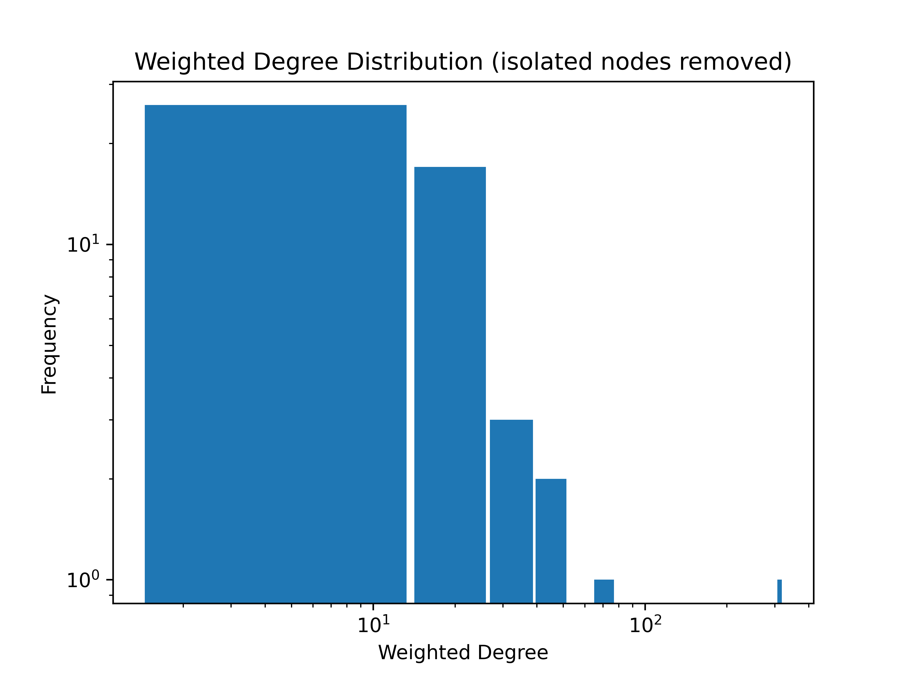
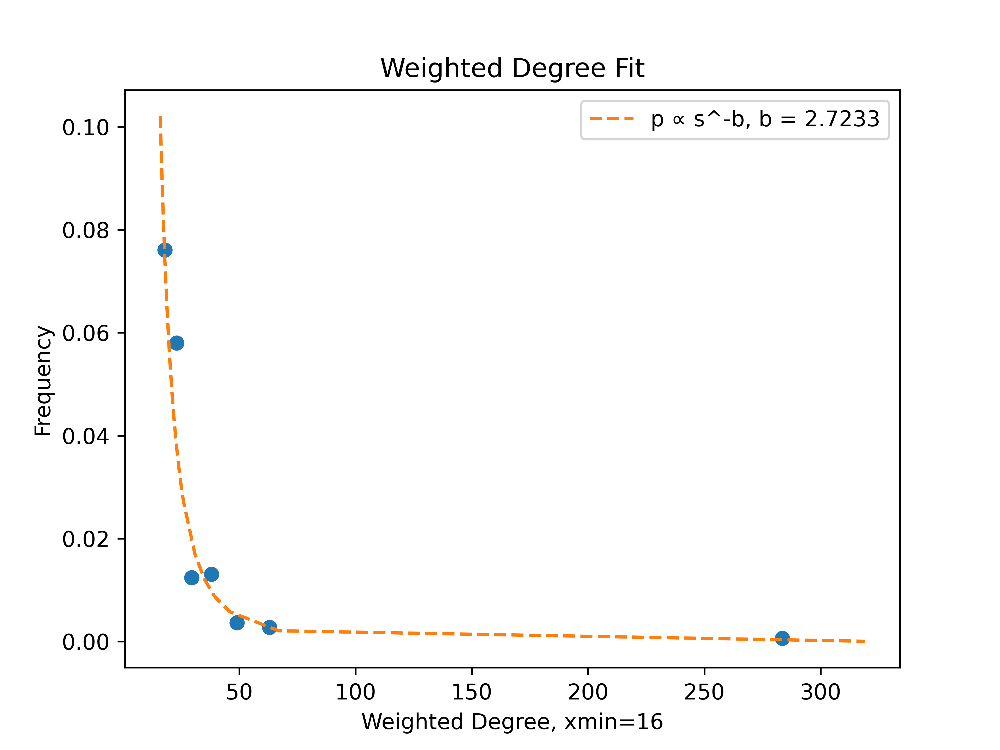

# Telegram Group Network Analysis


## Overview

We studied the communication network among course members within the Telegram group. We collected data on users and message interactions using Telegram’s MTProto API and `telethon` library. The gathered data was saved in a database for further analysis. We analyzed the degree distribution of individuals interacting, revealing power-law behavior akin to real social networks. 
The network was constructed in `networkx` based on interactions such as replies, reactions, and pinned messages.

## Features

- We used Telegram's MTProto API and `telethon` library for data collection.
- Captures and stores user profiles and various message interactions in a database.
- Analyzes the degree distribution of participants engaging in interactions, revealing power-law behavior akin to real social networks.
- Constructs a network framework incorporating interactions such as replies, reactions, and pinned messages, offering insights into network dynamics and participant engagement patterns.

## Dataset
To protect the participants' privacy, the dataset is not included in the repository. We may release an anonymized version of the dataset in the future.

## Plots
Check the slides from our presentation [here](report/telegram-presentation.pdf). 







## Installation

1. Clone the repository.

2. Install dependencies:

```bash
pip install -r requirements.txt
```

3. Create and fill `credentials.py`:

```python
api_id = your_api_id
api_hash = 'your_api_hash'
phone_number = '+989xxxxxxxxx'
```

## Usage

1. Obtain a personal Telegram client code to access the Telegram API.
2. Configure the Telegram API credentials in the project.
3. Run the data collection script to gather user profiles and message interactions.
4. Analyze the collected data using the provided analysis tools.
5. Visualize the network structure.

## License

This project is licensed under the MIT License - see the [LICENSE](LICENSE) file for details.

## Acknowledgments

- Thanks to Prof. Saman Moghimi-Araghi for guiding us in this project.
- Thanks to the creators of Telegram and Telethon for providing robust APIs and libraries for data collection.
- Hat tip to the course participants of the course Network Analysis Fall Semester 2023 whose interactions formed the basis of this analysis.
